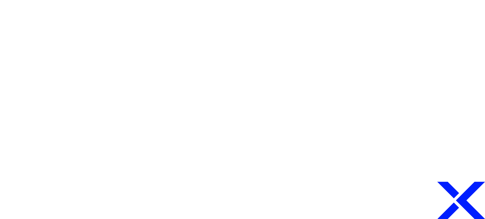

<div align="center">



# ⚡ SevenDevX — Plataforma Web + SevenOS

### _Transformamos ideias em soluções digitais de alto impacto._

**Site institucional premium + ERP/CRM interno (SevenOS) construídos sobre uma arquitetura Full Stack moderna com React, TypeScript, Supabase Edge e Inteligência Artificial.**

[](https://sevendevx.com)
[](https://github.com/DavidsonDias/SevenDevX/blob/main/LICENSE)
[](https://vercel.com)
[](https://sevendevx.com)
[]()
[](https://sevendevx.com)
[](https://sevendevx.com)

<br>


<br>


<br>

🌐 **Produção:** https://sevendevx.com _(domínio oficial — propagação DNS em andamento)_  
🟢 **Live agora:** https://sevendevx.lovable.app  
🚀 **Deploy:** Vercel Edge Network  
🏢 **HQ:** Belo Horizonte • MG • Brasil  
⚡ **Arquitetura:** React + TypeScript + Supabase + Edge Functions + AI

</div>

---

## 📑 Sumário

- [📖 Sobre o Projeto](#-sobre-o-projeto)
- [📊 Métricas Reais](#-métricas-reais)
- [🎭 Dois Produtos, Uma Stack](#-dois-produtos-uma-stack)
- [🧩 Stack Tecnológica Completa](#-stack-tecnológica-completa)
- [🏛️ Arquitetura Geral](#️-arquitetura-geral)
- [🌐 SevenDevX — Site Público](#-sevendevx--site-público)
- [🛠️ SevenOS — ERP/CRM Interno](#️-sevenos--erpcrm-interno)
- [☁️ O que é Serverless aqui?](#️-o-que-é-serverless-aqui)
- [⚡ Edge Functions (28 funções)](#️-edge-functions-28-funções)
- [🗄️ Banco de Dados — RLS + GRANTs](#️-banco-de-dados--rls--grants)
- [📂 Estrutura Completa de Pastas](#-estrutura-completa-de-pastas)
- [🎨 Design System](#-design-system)
- [🌍 SEO + GEO (AI-first)](#-seo--geo-ai-first)
- [🔐 Segurança + RBAC](#-segurança--rbac)
- [🚀 Performance & PWA](#-performance--pwa)
- [🌎 Internacionalização](#-internacionalização)
- [💻 Como Rodar Localmente](#-como-rodar-localmente)
- [🧰 Ferramentas & Integrações](#-ferramentas--integrações)
- [🎯 Performance & SEO](#-performance--seo)
- [📊 Status do Projeto](#-status-do-projeto)
- [🗺️ Roadmap](#️-roadmap)
- [💬 Contato](#-contato)
- [🏆 Créditos](#-créditos)
- [📜 Licença](#-licença)


---

## 📖 Sobre o Projeto

A **SevenDevX** é uma empresa brasileira de tecnologia e desenvolvimento de software, sediada em **Belo Horizonte (MG)**, especializada na criação de soluções digitais modernas, escaláveis e orientadas a resultados.

### 🚀 Nossas Especialidades

- 🌐 **Desenvolvimento Web Full Stack**
- 💻 **Sites Institucionais e Landing Pages de Alta Conversão**
- 🛒 **E-commerce Moderno e Headless Commerce**
- 🧠 **Sistemas Web Sob Medida (ERP, CRM, SaaS e Portais)**
- 🤖 **Integrações com Inteligência Artificial e Automações**
- 📱 **Progressive Web Apps (PWAs) Enterprise**
- 🛠️ **Instalação e Implantação de Software Empresarial**
- 🔧 **Suporte Técnico, Infraestrutura e Manutenção de Hardware**


### 🎯 Objetivo do Projeto

Este projeto representa a plataforma institucional oficial da **SevenDevX**, funcionando simultaneamente como:

- ✨ **Portfólio digital interativo**
- 🚀 **Vitrine de serviços e soluções tecnológicas**
- 💼 **Demonstração prática de capacidade técnica**
- 📞 **Canal de geração de leads e contato comercial**
- 🧠 **Hub de autoridade digital e posicionamento de marca**

Mais do que um website institucional, este projeto demonstra a aplicação real de arquitetura moderna, experiência do usuário avançada, SEO técnico e engenharia de software voltada para performance.


### ⚙️ Arquitetura e Tecnologia

O projeto foi concebido utilizando uma arquitetura moderna e escalável, baseada em princípios de performance, acessibilidade, indexação e experiência do usuário.

Entre os recursos implementados estão:

- ⚡ Arquitetura Full Stack moderna
- 🔍 SEO avançado e otimização para mecanismos de busca
- 🤖 GEO (Generative Engine Optimization) para IA e LLMs
- 📱 Design responsivo e mobile-first
- 🚀 Performance otimizada (Core Web Vitals)
- 🔐 Boas práticas de segurança e confiabilidade
- 🌙 Interface moderna inspirada no design da SpaceX
- 📈 Estrutura preparada para crescimento e evolução contínua


### 🌟 Nossa Missão

> **Transformar ideias em soluções digitais inteligentes, escaláveis e de alto impacto, conectando tecnologia, inovação e resultados reais para empresas de todos os portes.**


### 🔗 Produção

**Website Oficial:**  
👉 https://sevendevx.com

**Empresa:** SevenDevX — Software, Web, IA & Soluções Digitais

---

## 📊 Números do Projeto

> Contagens verificáveis diretamente no repositório. **Nenhuma métrica de performance é declarada sem medição** — abaixo, o que é meta está marcado como `Target`.

| Categoria | Métrica | Valor |
|-----------|---------|-------|
| 🧭 **Rotas** | Declaradas em `src/app/Router.tsx` (sendo 48 em `/admin`) | **77** |
| 🧩 **Componentes** | Design System · Admin · Módulos | **53 · 33 · 24** |
| 📄 **Páginas** | Arquivos em `src/pages` | **73** |
| 🪝 **Hooks** | Arquivos em `src/hooks` | **32** |
| ⚙️ **Edge Functions** | Diretórios em `supabase/functions` | **47** |
| 🗄️ **Database** | Migrations versionadas · Tabelas no schema `public` | **67 · 72** |
| 🌍 **i18n** | Idiomas do site público | **PT · EN · ES** |
| 📱 **PWA** | Instalável · Fallback offline · Push | **✅ · ✅ · ✅** |
| 🔐 **Segurança** | Papéis RBAC (`app_role`) | **3** |

### Targets de qualidade (não medidos automaticamente)

```txt
Target: LCP < 2.5s na home em 4G
Target: CLS < 0.1
Target: acessibilidade WCAG 2.1 AA
Target: nenhuma resposta de API servida a partir do cache do Service Worker
```


---

## 🎭 Dois Produtos, Uma Stack

| Produto | O que é | Acesso | Rota |
|---|---|---|---|
| 🌐 **SevenDevX** | Site institucional premium: portfólio, blog, GEO/SEO, captação de leads, chatbot IA | Público | `/`, `/sobre`, `/servicos`, `/projetos`, `/blog`, `/contato`, `/local/:cidade`, `/geo/*` |
| 🛠️ **SevenOS** | ERP/CRM interno enterprise: 28 módulos administrativos cobrindo CRM, financeiro, projetos, automações, IA Ops, observabilidade | Privado (RBAC `admin`/`moderator`) | `/admin/*` |

> ⚠️ **SevenOS é INTERNO da SevenDevX** — não é SaaS multi-tenant. Não há billing/quota/planos.

---

## 🧩 Stack Tecnológica Completa

A arquitetura da **SevenDevX** foi projetada para entregar aplicações modernas, escaláveis, seguras e preparadas para crescimento, combinando experiência premium no frontend, backend serverless de alta performance, observabilidade, automação e recursos de Inteligência Artificial.


### 🎨 Frontend Engineering

<div align="center">

| Tecnologia | Versão | Função |
|------------|:------:|---------|
|  | 18.3+ | Interface declarativa moderna |
|  | 5+ | Tipagem forte end-to-end |
|  | 5+ | Build ultra rápido e HMR |
|  | 3+ | Design System baseado em tokens |
|  | 12+ | Motion Design e microinterações |
|  | 3.13+ | Animações avançadas |
|  | Latest | Componentes modernos |
|  | Latest | Componentes acessíveis (WCAG) |
|  | v6 | Roteamento SPA |
|  | v7 | Gerenciamento de formulários |
|  | v3 | Validação schema-first |
|  | v5 | Cache e sincronização de dados |
|  | Latest | Dashboards e Analytics |
|  | Latest | Biblioteca de ícones SVG |
|  | Latest | Offline-first e Service Worker |

</div>


### ⚙️ Backend & Cloud Infrastructure

<div align="center">

| Tecnologia | Versão | Função |
|------------|:------:|---------|
|  | Latest | Autenticação JWT + OAuth |
|  | 16+ | Banco relacional escalável |
|  | Latest | Segurança em nível de linha (RLS) |
|  | Latest | Backend Serverless em Deno |
|  | Latest | Arquivos privados com Signed URLs |
|  | Latest | Atualizações em tempo real |
|  | 2+ | Runtime das Edge Functions |
|  | Latest | Tokens seguros de autenticação |
|  | OAuth 2.0 | Login social |
|  | Latest | Notificações Push |

</div>


### 🤖 Inteligência Artificial & Automação

<div align="center">

| Tecnologia | Versão | Aplicação |
|------------|:------:|------------|
|  | GPT-5 | IA Generativa |
|  | 2.5 Pro | Processamento multimodal |
|  | Latest | Gateway de modelos |
|  | Latest | Busca contextual inteligente |
|  | Latest | Generative Engine Optimization |
|  | Enterprise | Fluxos automatizados |

</div>


### 🚀 DevOps, Deploy & Performance

<div align="center">

| Tecnologia | Versão | Função |
|------------|:------:|---------|
|  | Latest | Deploy Global Edge |
|  | Latest | Versionamento Git |
|  | Latest | Design e prototipação |
|  | Latest | SEO e indexação |
|  | 9+ | Qualidade de código |
|  | 3+ | Padronização do código |
|  | Strict | Segurança em tempo de desenvolvimento |
|  | Latest | Proteção contra ataques XSS |
|  | Latest | Deploy global distribuído |
|  | Google | Performance otimizada |

</div>


### 🏗️ Arquitetura

```text
Frontend (React + TypeScript)
          │
          ▼
Vercel Edge Network
          │
          ▼
Supabase Platform
├── PostgreSQL
├── Auth
├── Storage
├── Realtime
└── Edge Functions
          │
          ▼
AI Gateway
├── GPT-5
├── Gemini 2.5
└── Automações Inteligentes
```


### 🌟 Diferenciais SevenDevX

✅ Arquitetura Full Stack Moderna
✅ Serverless First
✅ Mobile First
✅ SEO + GEO Ready
✅ PWA Enterprise
✅ Integração com IA
✅ Segurança com RLS e JWT
✅ Escalabilidade Horizontal
✅ Edge Computing
✅ Alta Performance (Core Web Vitals)
✅ UX Inspirada na SpaceX
✅ Código Type-Safe End-to-End

> SevenDevX — Transformando ideias em soluções digitais inteligentes, escaláveis e de alto impacto.

---

## 🏛️ Arquitetura Geral

```text
                         ┌────────────────────────────┐
                         │      USUÁRIOS / BOTS       │
                         │  Humanos · GPTBot · Claude │
                         └─────────────┬──────────────┘
                                       │
                       ┌───────────────┴────────────────┐
                       │     VERCEL EDGE (CDN + HTTPS)  │
                       │   sevendevx.com / lovable.app  │
                       └───────────────┬────────────────┘
                                       │
                ┌──────────────────────┴──────────────────────┐
                │                                             │
        ┌───────▼────────┐                          ┌─────────▼────────┐
        │  SPA (React)   │                          │  Service Worker  │
        │  Site + Admin  │                          │  PWA + Offline   │
        └───────┬────────┘                          └─────────┬────────┘
                │                                             │
                └────────────────┬────────────────────────────┘
                                 │  (HTTPS + JWT)
              ┌──────────────────┴───────────────────┐
              │     SUPABASE EDGE RUNTIME (Deno)     │
              │   28 Edge Functions globais          │
              └──────────────────┬───────────────────┘
                                 │
        ┌────────────┬───────────┼───────────┬──────────────┐
        │            │           │           │              │
   ┌────▼────┐  ┌────▼────┐  ┌──▼───┐  ┌────▼─────┐  ┌─────▼──────┐
   │Postgres │  │ Storage │  │ Auth │  │ Realtime │  │  Lovable   │
   │  + RLS  │  │ private │  │OAuth │  │ channels │  │ AI Gateway │
   └─────────┘  └─────────┘  └──────┘  └──────────┘  └────────────┘
```

---

## 🌐 SevenDevX — Site Público

Construído para **conversão + autoridade + descoberta por IA**.

### 📄 Páginas principais
- 🏠 `/` — Hero, Serviços, **PsicoOne hero card**, Tech Stack, Testimonials 3D, Contato
- 👤 `/sobre` — Sobre com counters premium e timeline
- 🛎️ `/servicos` — Catálogo CMS-driven
- 💼 `/projetos` + `/projetos/:slug` — Portfólio com `layoutId` transitions + 3D tilt
- ✍️ `/blog` + `/blog/:slug` — CMS com schema.org `Article`, reading progress, shared layout
- 📬 `/contato` — Multi-step form, salva no DB antes do redirect (zero perda de lead)
- 🛒 `/store`, `/fornecedores`, `/perfil`, `/auth`
- 📍 `/local/:cidade` — 15 páginas SEO local (BH, SP, RJ, POA, FLN, SSA, REC, FOR, GYN, CPQ, VIX, MAO, UDI, …)
- 🤖 `/geo/*` — AI Hub, Case Studies, Content Clusters, Solution Pages

### ✨ UX Premium
- Glassmorphism + monochrome bg/fg
- Motion design global (spring `stiffness: 150, damping: 20`)
- 3D tilt nos cards de projeto/serviço (desativado no mobile)
- FAB WhatsApp + Chatbot 7AI flutuantes
- **Command Palette ⌘K** (busca cross-entidade)
- Exit-intent popup
- PWA instalável + offline fallback
- Page transitions com `AnimatePresence`

---

## 🛠️ SevenOS — ERP/CRM Interno

Acessível em `/admin/*` para usuários com role `admin` ou `moderator` (RBAC via `user_roles` + `has_role()` security-definer).

### 🗂️ 28 Módulos do SevenOS

| Categoria | Módulo | Rota | Função |
|---|---|---|---|
| 🏠 **Core** | Dashboard | `/admin` | KPIs, leads, gráficos Recharts, ActivityFeed Realtime |
| 👥 **CRM** | Clientes | `/admin/clients` | CRM + histórico de interações |
| 👥 | Pipeline | `/admin/pipeline` | Kanban de oportunidades + stage log |
| 👥 | Contact Center | `/admin/contact-center` | Inbox de mensagens do site |
| 📂 **Projetos** | Projetos | `/admin/projects` | Listagem + filtros + cards 3D |
| 📂 | Projeto detalhe | `/admin/projects/:id` | Stages, checklists, docs, integrações, finanças, time tracking |
| 📂 | Processos | `/admin/process` | Templates de processo reutilizáveis |
| 💰 **Financeiro** | Financeiro | `/admin/finance` | Transactions, budgets, FX rates, margem (`fn_project_margin`) |
| 🎨 **CMS** | Serviços | `/admin/services` | Edita `/servicos` |
| 🎨 | Tecnologias | `/admin/technologies` | Registry de techs |
| 🎨 | Tags | `/admin/tags` | Tag registry central |
| 🎨 | FAQ | `/admin/faq` | FAQ + Speakable schema |
| 🎨 | Logo Lab | `/admin/logo-lab` | Extração de paleta dominante |
| 🎨 | Logo Library | `/admin/logo-library` | Biblioteca de marcas |
| 🔌 **Integrações** | Marketplace | `/admin/integrations` | Stripe, Resend, Slack, Discord, WhatsApp, Vercel, GitHub, Figma, OpenAI… |
| 🔌 | Automações | `/admin/automations` | Flow builder visual + runs |
| 🔌 | Webhooks | `/admin/webhooks` | Dispatch + debugger + payload viewer |
| 🤖 **IA & SEO** | AI Ops | `/admin/ai-ops` | Telemetria de uso de IA |
| 🤖 | GEO Analytics | `/admin/geo-analytics` | Health Score, bot hits, indexação |
| 🤖 | Citation Engine | `/admin/citations` | Monitor de menções em ChatGPT/Gemini/Claude/Perplexity/Copilot — **pausável**, queries/modelos editáveis |
| 🤖 | Search Console | `/admin/search-console` | GSC via Connector Gateway |
| 📊 **Observabilidade** | System Health | `/admin/system-health` | Status grid + activity realtime |
| 📊 | Incidents | `/admin/incidents` | Timeline de incidentes |
| 📊 | Logs | `/admin/logs` | Logs centralizados |
| 📊 | Events | `/admin/events` | Audit log + activity feed |
| 🔐 **Acesso** | Security | `/admin/security` | Sessions + scans |
| 🔐 | Users | `/admin/users` | RBAC + UserDetailsModal |
| 🔐 | Sessions | `/admin/sessions` | Admin sessions ativas |

### 🎁 Recursos Transversais do SevenOS
- ⌘K **Command Palette** (busca + ações cross-entidade)
- 📡 **Activity Feed em tempo real** (Realtime + trigger de audit)
- 🧠 **Smart Insights** com recomendações de IA
- 📱 **Mobile Bottom Nav** + **Radial Action Menu** + **Global FAB**
- ⏱️ **Time Tracker Widget** flutuante (start/stop por projeto)
- 📎 **AttachmentManager** com bucket privado + signed URLs
- 🔔 **Push Notifications** (VAPID)
- 📝 **Contract Builder** com versionamento e diff modal

---

## ☁️ O que é "Serverless" aqui?

**Serverless ≠ "sem servidor".** Significa que **você não gerencia, mantém ou paga por servidor ocioso** — o código roda sob demanda em containers efêmeros na borda da rede.

Na SevenDevX isso se traduz em:

| Camada | Onde roda | O que faz |
|---|---|---|
| **Frontend (SPA)** | CDN Vercel (edge) | HTML/JS/CSS estáticos servidos de POPs globais |
| **API / Backend** | **Supabase Edge Functions** (Deno, ~30 regiões) | Todo backend customizado: IA, webhooks, integrações, GSC, push, monitor de citações |
| **Banco** | Supabase Postgres (managed) | Dados transacionais com RLS |
| **Auth** | Supabase Auth (managed) | JWT, OAuth, sessions |
| **Storage** | Supabase Storage (managed) | Buckets S3-compatíveis privados |
| **Realtime** | Supabase Realtime (managed) | WebSockets para Activity Feed, Citations |

### ✅ Benefícios concretos do modelo
- 🌍 **Latência baixa global** (edge runtime na borda)
- 💸 **Custo por uso** — pausou? Custo zero (ex: Citation Monitor pausado = 0 chamadas de IA)
- 🔁 **Auto-scaling infinito** — sem worry de provisionamento
- 🛡️ **Zero patching de SO** — Supabase/Vercel cuidam
- 🚀 **Deploy contínuo** — push → live em ~30s

---

## ⚡️ Edge Functions (28 funções)

Tudo backend roda em **Supabase Edge Functions (Deno runtime)** distribuídas globalmente.

### 🤖 IA & GEO
| Função | Propósito |
|---|---|
| `ai-chat` | Chatbot streaming do site com personalidade 7AI (Markdown, histórico) |
| `ai-engine` | Proxy genérico para Lovable AI Gateway |
| `ai-ops` | Telemetria de uso de IA + recomendações |
| `citation-monitor` | Pergunta às IAs sobre a SevenDevX, classifica sentimento, salva em `ai_citations`. **Pausável** via `citation_monitor_settings.enabled` — quando pausado retorna `{paused:true}` sem chamar nenhum modelo (zero custo) |
| `project-generator` | Cria scaffolding de projeto com IA |

### 🔍 SEO
| Função | Propósito |
|---|---|
| `gsc-insights` | Google Search Console (sites + searchAnalytics) via Connector Gateway |

### 📈 Analytics & Eventos
| Função | Propósito |
|---|---|
| `track-analytics` | Pageviews + eventos customizados |

### 🔗 Integrações & Webhooks
| Função | Propósito |
|---|---|
| `webhook-dispatch` | Envio + retry exponencial de webhooks |
| `provider-secrets-check` | Verifica se cada secret está set (booleano, sem expor valor) — admin-only |
| `provider-test` | Smoke test genérico de provider |
| `vercel-info`, `vercel-test`, `vercel-watch` | Status de deploys, alertas |
| `github-info`, `github-test` | Repo + smoke test |
| `figma-info`, `figma-test` | Workspace + smoke test |
| `stripe-test`, `resend-test`, `slack-test`, `discord-test`, `whatsapp-test`, `openai-test` | Conectividade de cada provider |

### 🔔 Push & Admin
| Função | Propósito |
|---|---|
| `push-public-key` | Retorna VAPID public key |
| `push-send` | Envia Web Push autenticado |
| `admin-delete-user` | Hard delete seguro de usuário (admin-only) |

### 📊 Status do Serverless
- ✅ **28 Edge Functions** em produção
- ✅ Auto-deploy a cada push
- ✅ Cold start médio: **~30–60ms**
- ✅ `corsHeaders` padronizado em todas
- ✅ Validação Zod onde há input do usuário
- ✅ `LOVABLE_API_KEY` **server-side only** (nunca exposto ao browser)
- ✅ Logs centralizados via `console.log` → Supabase Logs

---

## 🗄️ Banco de Dados — RLS + GRANTs

- **46 migrations** versionadas em `supabase/migrations/`
- **RLS habilitado em 100%** das tabelas `public.*`
- **GRANTs explícitos** em cada `CREATE TABLE` (anon/authenticated/service_role)
- **Roles em tabela separada** (`user_roles`) — nunca no `profiles` (anti privilege escalation)
- **Função security-definer** `has_role(uuid, app_role)` usada em todas as policies admin
- **Bucket `attachments` privado** — sempre `createSignedUrl`, nunca `getPublicUrl`
- **Triggers**: `audit_log` automático em mutations sensíveis
- **RPCs**: `fn_project_margin`, `has_role`, `handle_new_user`

---

## 📂 Estrutura Completa de Pastas

> Árvore única e consolidada — site público + SevenOS Enterprise (Phases 1 → 10).
> Cada arquivo recebe seu próprio ícone para leitura visual rápida.

```text
sevendevx/
│
├── 📁 public/                                  # 🌐 Estáticos servidos pela CDN
│   ├── 🤖 ai.txt                               # Diretivas para crawlers de IA
│   ├── 🤖 llms.txt                             # Manifesto LLM-friendly
│   ├── 🤖 llm-context.json                     # Dataset estruturado p/ RAG
│   ├── 🤖 robots.txt                           # Libera GPTBot, ClaudeBot, etc
│   ├── 🗺️  sitemap.xml                         # Sitemap dinâmico (cidades + cases + artigos)
│   ├── 📱 manifest.json                        # PWA manifest
│   ├── 📱 sw.js                                # Service Worker compilado
│   ├── 📱 offline.html                         # Fallback offline
│   ├── 🎨 placeholder.svg
│   └── 📁 icons/tech/                          # 🧩 SVGs de tecnologias (docker, python, vite, redis…)
│
├── 📁 src/
│   │
│   ├── 📁 app/                                 # 🎯 Bootstrap da aplicação
│   │   ├── 🧬 Providers.tsx                    # QueryClient + Auth + Language + Tooltip
│   │   └── 🛣️  Router.tsx                       # Rotas lazy + AnimatePresence
│   │
│   ├── 📁 pages/                               # 🖼️ Páginas (site + admin)
│   │   ├── 🏠 Home.tsx                         # Landing principal
│   │   ├── 👤 About.tsx                        # Quem somos / E-E-A-T
│   │   ├── 🛎️  Services.tsx                    # Serviços (CMS-driven + LucideIcons)
│   │   ├── 💼 Projects.tsx                     # Portfólio público
│   │   ├── 🗂️  ProjectsHub.tsx                 # Hub de projetos
│   │   ├── 🔎 ProjectDetail.tsx                # Detalhe do projeto
│   │   ├── 📝 Blog.tsx                         # Listagem de posts
│   │   ├── 📰 BlogPost.tsx                     # Post individual (markdown)
│   │   ├── 🔐 Auth.tsx                         # Login / signup
│   │   ├── 👤 Profile.tsx                      # Perfil enterprise (hero, badges, security)
│   │   ├── 🛒 Store.tsx                        # Loja interna
│   │   ├── 🏭 Fornecedores.tsx                 # Catálogo de fornecedores
│   │   ├── 🛒 IntegrationsMarketplace.tsx      # Marketplace público (100+ tools)
│   │   ├── 🔐 OAuthCallback.tsx                # Landing OAuth (code + state)
│   │   ├── 📄 PrivacyPolicy.tsx                # LGPD / Privacidade
│   │   ├── 🚫 NotFound.tsx                     # 404 glitch
│   │   ├── 🏁 Index.tsx                        # Entrypoint
│   │   │
│   │   ├── 📁 admin/                           # 🛠️ === SevenOS · Enterprise OS ===
│   │   │   ├── 📊 AdminDashboard.tsx           # KPIs, charts, atalhos
│   │   │   │
│   │   │   ├── 👥 CRM & Pipeline
│   │   │   │   ├── 👤 ClientsAdmin.tsx
│   │   │   │   ├── 💳 ClientsFinanceAdmin.tsx
│   │   │   │   ├── 🪜 PipelineAdmin.tsx
│   │   │   │   ├── 📨 ContactCenterAdmin.tsx
│   │   │   │   └── 💬 ResponseTemplatesAdmin.tsx
│   │   │   │
│   │   │   ├── 📂 Projetos & Processos
│   │   │   │   ├── 💼 ProjectsAdmin.tsx
│   │   │   │   ├── 🔍 ProjectDetailAdmin.tsx
│   │   │   │   ├── 🐛 ProjectsDebug.tsx
│   │   │   │   ├── 🔁 ProcessAdmin.tsx
│   │   │   │   └── 📅 EventsAdmin.tsx
│   │   │   │
│   │   │   ├── 💰 Financeiro Enterprise
│   │   │   │   ├── 💵 FinanceAdmin.tsx              # Receitas/despesas core
│   │   │   │   ├── 💹 CashflowAdmin.tsx             # Projeção saldo 90d
│   │   │   │   ├── 📈 ForecastAdmin.tsx             # Projeções financeiras
│   │   │   │   └── 🧾 ReconciliationAdmin.tsx       # Conciliação bancária CSV
│   │   │   │
│   │   │   ├── 📝 Conteúdo & CMS
│   │   │   │   ├── 🛎️  ServicesAdmin.tsx            # CMS + LucideIconPicker + cover
│   │   │   │   ├── ✍️  BlogAdmin.tsx + BlogPostEditor # Markdown + cover image
│   │   │   │   ├── ⚛️  TechnologiesAdmin.tsx
│   │   │   │   ├── 🏷️  TagsAdmin.tsx
│   │   │   │   └── ❓ FaqAdmin.tsx
│   │   │   │
│   │   │   ├── 🎨 Brand & Logo Lab
│   │   │   │   ├── 🧪 LogoLabAdmin.tsx              # Logo Lab + Variações IA
│   │   │   │   ├── 📚 LogoLibraryAdmin.tsx
│   │   │   │   └── 🎨 BrandStudioAdmin.tsx          # URL scan → palette + favicon kit
│   │   │   │
│   │   │   ├── 🔌 Integrações & Automações
│   │   │   │   ├── 🔌 IntegrationsAdmin.tsx
│   │   │   │   ├── ⚡ AutomationsAdmin.tsx
│   │   │   │   ├── 🎬 AutomationRunsAdmin.tsx       # Replay de execuções
│   │   │   │   ├── 🪝 WebhooksAdmin.tsx
│   │   │   │   ├── ☠️  DlqAdmin.tsx                 # Dead Letter Queue
│   │   │   │   ├── 🔐 OAuthAdmin.tsx                # GitHub/Google/Slack/Notion
│   │   │   │   └── ⏱️  CronAdmin.tsx                # Gestão visual pg_cron
│   │   │   │
│   │   │   ├── 🤖 IA & GEO
│   │   │   │   ├── 🧠 AiOpsAdmin.tsx                # Lead scoring + draft (Gemini)
│   │   │   │   ├── 📣 CitationsAdmin.tsx            # Monitor citações IA
│   │   │   │   ├── 🌎 GeoAnalyticsAdmin.tsx
│   │   │   │   └── 🔍 SearchConsoleAdmin.tsx        # GSC insights
│   │   │   │
│   │   │   ├── 💬 Comunicação
│   │   │   │   ├── 💚 WhatsAppInboxAdmin.tsx        # Meta Cloud API inbox
│   │   │   │   ├── 🔔 NotificationsAdmin.tsx
│   │   │   │   └── 🎚️  NotificationPreferencesAdmin.tsx
│   │   │   │
│   │   │   ├── ❤️ Saúde & Operações
│   │   │   │   ├── 🩺 SystemHealthAdmin.tsx
│   │   │   │   ├── 🚨 IncidentsAdmin.tsx            # Auto-criados por health checks
│   │   │   │   └── 📜 LogsAdmin.tsx
│   │   │   │
│   │   │   ├── 🛡️ Segurança & Acesso
│   │   │   │   ├── 🛡️  SecurityAdmin.tsx            # MFA / IP allow / rate limits
│   │   │   │   ├── 🔑 MfaAdmin.tsx                  # TOTP + QR
│   │   │   │   ├── 👥 UsersAdmin.tsx
│   │   │   │   └── 💻 SessionsAdmin.tsx
│   │   │   │
│   │   │   └── 💾 Backup & Sistema
│   │   │       ├── 💾 BackupAdmin.tsx               # Snapshots de tenant
│   │   │       ├── ♻️  RestoreAdmin.tsx             # Restore seletivo
│   │   │       └── ⚙️  SystemSettingsAdmin.tsx      # Config global + retenção
│   │   │
│   │   └── 📁 geo/                             # 🤖 Páginas GEO (AI-first)
│   │       ├── 🧠 AIHub.tsx                    # Hub de respostas p/ IAs
│   │       ├── 🏆 WhySevenDevX.tsx             # Posicionamento E-E-A-T
│   │       ├── 📚 CaseStudies.tsx              # 10 cases estruturados
│   │       ├── 🧩 ContentClusters.tsx          # Topic clusters
│   │       ├── 📰 GeoArticle.tsx               # Template de artigo GEO
│   │       ├── 📍 LocalSeoPage.tsx             # Template /local/:cidade (15 cidades)
│   │       └── 💡 SolutionPage.tsx             # Template de solução
│   │
│   ├── 📁 components/                          # 🧱 Componentes do site
│   │   ├── 🦸 Hero.tsx
│   │   ├── 🧭 Header.tsx                       # Underline gradient nav
│   │   ├── 🦶 Footer.tsx
│   │   ├── ⬆️  ScrollToTop.tsx
│   │   ├── 📬 Contact.tsx · ContactMultiStep.tsx
│   │   ├── 💰 OrcamentoButton.tsx · OrcamentoModal.tsx
│   │   ├── 🃏 ProjectCard3D.tsx · ProjectModal.tsx · ProjectsPreview.tsx
│   │   ├── 🎠 PortfolioCarousel3D.tsx · PortfolioFilter.tsx · FeaturedProjects.tsx
│   │   ├── 🛎️  ServiceCard3D.tsx · ServicesPreview.tsx
│   │   ├── ⚛️  TechShowcase.tsx · TechIcon.tsx · TechIconCDN.tsx · TechModal.tsx · TechPreview.tsx
│   │   ├── 🏷️  TagIcon.tsx
│   │   ├── 💬 TestimonialsCarousel3D.tsx · Testimonials.tsx
│   │   ├── 🤖 AIChatbot.tsx
│   │   ├── 💚 WhatsAppButton.tsx
│   │   ├── 🚪 ExitIntentPopup.tsx
│   │   ├── 🪟 GlassCard.tsx
│   │   ├── 🎞️  PageTransition.tsx
│   │   ├── 〰️  SectionDivider.tsx (+ .css)
│   │   ├── 💀 SkeletonLoader.tsx
│   │   ├── 🔍 SEOHead.tsx · BreadcrumbSchema.tsx · EntityGraphSchema.tsx · GeoKnowledgeGraph.tsx
│   │   ├── 📲 PWAUpdatePrompt.tsx · AppInstallerButton.tsx
│   │   ├── 🌍 LanguageSwitcher.tsx
│   │   │
│   │   ├── 📁 admin/                           # 🛠️ Componentes do SevenOS
│   │   │   ├── 🧭 AdminMenu.tsx · 🪟 AdminPageShell.tsx · 🚧 AdminComingSoon.tsx · 🍞 Breadcrumb.tsx
│   │   │   ├── 🔎 GlobalSearch.tsx (⌘K) · 📊 KpiCards.tsx · 📡 ActivityFeed.tsx
│   │   │   ├── 💡 SmartInsights.tsx · 🧠 AiInsightsBlock.tsx · 🤖 AiProjectGeneratorModal.tsx
│   │   │   ├── ⏸️  CitationMonitorSettings.tsx   # pausa, queries, modelos
│   │   │   ├── 📄 ContractCard.tsx · 🕒 ContractVersionHistory.tsx · 🔀 AuditDiffModal.tsx
│   │   │   ├── 📎 AttachmentManager.tsx · 👁️  FilePreview.tsx · 🖼️  IconUploader.tsx
│   │   │   ├── 🎯 LucideIconPicker.tsx · 🖌️  LucideIconRender.tsx
│   │   │   ├── 👤 ClientPicker.tsx · 🏷️  TagMultiSelect.tsx · ⚛️  TechMultiSelect.tsx
│   │   │   ├── 💲 PricingEngineModal.tsx · 🔔 PushSubscribeButton.tsx · 📂 StageDocuments.tsx
│   │   │   ├── 📁 finance/        💰 ProjectFinanceBlock · ⏱️  TimeTrackerWidget
│   │   │   └── 📁 integrations/   🔌 ProjectIntegrationsBlock
│   │   │
│   │   ├── 📁 auth/               🛡️  ProtectedRoute.tsx   # Guard de role + redirect
│   │   ├── 📁 layout/             📦 Container.tsx · 📐 Section.tsx
│   │   ├── 📁 security/           🚫 Blocker.tsx           # Bloqueio anti-bot
│   │   ├── 📁 services/           ❓ FAQSection.tsx · 🔁 ProcessSection.tsx
│   │   └── 📁 ui/                 🎨 shadcn/ui (button, dialog, sheet, …)
│   │
│   ├── 📁 modules/                             # 🧩 Features ricas do SevenOS
│   │   ├── 📁 automations/    ⚡ AutomationFlowBuilder · 📖 AutomationGuideDrawer · 🧰 automationTemplates
│   │   ├── 📁 branding/       🎨 LogoEditorModal
│   │   ├── 📁 integrations/   🛒 MarketplaceModal · ⚙️  ProviderConfig · 📜 Logs · 🧪 TestPanel · 🖼️  ProviderLogo · 🗂️  providerCatalog · 🧭 GuidedConnectionTest · 📖 SetupGuideDrawer · 📊 TestResultPanel · 🔍 IntegrationDetailsModal
│   │   ├── 📁 layout/         🟢 GlobalFAB · 📱 MobileBottomNav · 🎯 RadialActionMenu
│   │   ├── 📁 notifications/  🔔 NotificationBell          # Realtime + badges
│   │   ├── 📁 onboarding/     🧭 OnboardingTour · ✅ OnboardingChecklist · 🪜 tourSteps
│   │   ├── 📁 system-health/  🩺 HealthStatusGrid · 📡 RealtimeActivityFeed · 🧠 AIRecommendationPanel
│   │   ├── 📁 users/          👤 UserDetailsModal
│   │   └── 📁 webhooks/       🐞 WebhookDebugger · 📖 WebhookGuideDrawer · 📦 WebhookPayloadViewer
│   │
│   ├── 📁 hooks/                               # 🪝 Hooks customizados
│   │   ├── 💼 useProjects · 💰 useFinance · ⏱️  useTimeTracking
│   │   ├── 🔌 useIntegrations · ⭐ useIntegrationFavorites · 📎 useAttachments
│   │   ├── 📋 useAuditLog · 💡 useSmartInsights · 📈 useAnalytics
│   │   ├── 🤖 useAiReferralTracker · 🔔 usePushSubscription · 🧭 useSessionTracker
│   │   ├── 🎨 useBrandPalette · 🌈 useExtractedColor · ✨ useResolvedAccent · 🖼️  useLogoOverrides
│   │   ├── 👤 useContacts · 📄 useContractVersions · 📁 useDocuments · 🌐 useEcosystem
│   │   ├── 🗂️  useRegistry · 🔒 useScrollLock · ↩️  useSmartBack
│   │   ├── 🔐 useMfa                           # TOTP enroll/verify/disable
│   │   ├── 🔔 useNotifications                 # Realtime + read state
│   │   ├── 🧭 useOnboarding                    # Progresso de tour/checklist
│   │   ├── ⚙️  useSystemSettings               # Config global tipada
│   │   └── 📱 use-mobile · 🍞 use-toast
│   │
│   ├── 📁 contexts/        🔐 AuthContext.tsx       # Auth global (ÚNICO ponto)
│   ├── 📁 i18n/            🌍 LanguageContext + translations (PT/EN/ES)
│   ├── 📁 integrations/supabase/    🔌 client.ts + types.ts (auto-gerados — NÃO editar)
│   │
│   ├── 📁 core/branding/                       # 🎨 Brand core
│   │   ├── 📦 brandKit.ts                      # ZIP export (SVG/PNG/ICO/tokens.json)
│   │   └── 📁 palette-engine/                  # 🌈 extractPalette · knownBrands · tokens · index
│   │
│   ├── 📁 data/            📊 projects · caseStudies · geoContent · contentClusters · entityGraph · projectImages
│   ├── 📁 lib/             🛠️  utils · storage · money · contractBuilder · colorExtract
│   ├── 📁 utils/           🛠️  authErrors · theme · safeStorage · pdfExport · browserStorageGuard · registerServiceWorker · techData
│   ├── 📁 assets/          🎨 logo.svg · icons/ · imagens otimizadas
│   ├── 🚀 App.tsx · 🚀 main.tsx · 📱 sw.ts
│   ├── 🎨 index.css                            # Design tokens (HSL semânticos)
│   └── 🔤 fonts.css
│
├── 📁 supabase/
│   ├── ⚙️  config.toml
│   ├── 📁 migrations/                          # 🗄️ Migrations versionadas (RLS + GRANTs)
│   └── 📁 functions/                           # ☁️ === Edge Functions ===
│       │
│       ├── 🤖 IA & Análise
│       │   ├── 💬 ai-chat · 🧠 ai-engine · 🤖 ai-ops
│       │   ├── 🚀 ai-ops-autonomous              # Lead scoring + draft de projeto
│       │   ├── ⚖️  ai-contract-summarize         # Risco + cláusulas (Gemini)
│       │   ├── 🎯 lead-score-ai                  # Scoring isolado
│       │   ├── 🏗️  project-generator
│       │   └── 📣 citation-monitor               # ChatGPT/Gemini/Claude/Perplexity
│       │
│       ├── 🎨 Brand & Logo
│       │   ├── 🔬 brand-scan                     # URL → paleta dominante
│       │   └── 🪄 logo-variations-ai             # iconmark/horizontal/vertical/mono (Gemini Image)
│       │
│       ├── ⚡ Automação & Scheduler
│       │   ├── ⚡ automation-runner              # Execução com payload interpolado
│       │   ├── 📧 daily-digest                   # E-mail diário 8h BRT
│       │   ├── 📰 weekly-intel-report            # Report semanal segunda 8h BRT
│       │   └── ♻️  webhook-retry-worker          # Reprocessa DLQ
│       │
│       ├── 🔗 Webhooks & Integrações
│       │   ├── 📤 webhook-dispatch
│       │   ├── 🔐 provider-secrets-check · 🧪 provider-test
│       │   ├── ▲ vercel-info · vercel-test · 👀 vercel-watch
│       │   ├── 🐙 github-info · github-test
│       │   ├── 🎨 figma-info · figma-test
│       │   └── 🧪 stripe-test · resend-test · slack-test · discord-test · openai-test · whatsapp-test
│       │
│       ├── 💬 Comunicação
│       │   ├── 💚 whatsapp-send · whatsapp-webhook   # Meta Cloud API bidirecional
│       │   ├── 🔔 push-public-key · push-send
│       │   └── 🚨 incident-notify                # Discord/Slack alerts
│       │
│       ├── ❤️ Saúde & Observabilidade
│       │   ├── 🩺 health-collector               # Health + auto-incident
│       │   ├── 📈 track-analytics
│       │   └── 📍 session-geo                    # Geolocalização de sessões
│       │
│       ├── 🔐 Segurança & Auth
│       │   ├── 🗑️  admin-delete-user
│       │   ├── 🔑 mfa-enroll · mfa-verify · mfa-disable   # TOTP completo
│       │   └── 🔐 oauth-start · oauth-callback           # OAuth 2.0 PKCE
│       │
│       ├── 🔍 SEO
│       │   └── 📊 gsc-insights                   # Search Console
│       │
│       └── 💾 Backup
│           ├── 📤 tenant-export                  # Snapshot seletivo
│           └── 📥 tenant-restore                 # Restore granular
│
├── 📁 scripts/             🧰 generate-pwa-icons.js
├── ⚙️  tailwind.config.ts · vite.config.ts · vercel.json
├── ⚙️  components.json (shadcn) · eslint.config.js
├── ⚙️  tsconfig.json · tsconfig.app.json · tsconfig.node.json
├── 📄 index.html
└── 📄 README.md
```

---

## 🆕 Atualizações Recentes — Phases 1 → 10 (SevenOS Enterprise)

Desde a última revisão deste README, o SevenOS recebeu **10 fases consecutivas de evolução** que transformaram o ERP/CRM interno em uma plataforma de operações autônomas, segurança enterprise e inteligência de marca.

### 🌐 Site Público — Polimento UX
- Efeito **underline gradient animado** unificado em todos os links da navbar, menu mobile, botões LOGIN / ADMIN / PERFIL / SAIR.
- Página **Profile** reconstruída: hero card, badges de role, barra de progresso, grid de stats, painel de segurança.

### 🛡️ Phase 1 — Hardening de Segurança
- Rate limiting client-side, sanitização XSS, mappings de erro de auth amigáveis (`src/utils/authErrors.ts`).

### 🧭 Phase 2 — Onboarding · Notificações · Automações
- `onboarding_progress`, `notifications`, **`automation-runner`** edge function com interpolação de payload e triggers realtime.
- UI: `NotificationBell`, `OnboardingTour` (spotlight), `OnboardingChecklist`, `AutomationRunsAdmin` com replay.

### 🔐 Phase 3 — Reliability & MFA
- Tabelas `user_mfa` (TOTP + QR), `system_settings`, `webhook_dlq`, `tenant_backups`.
- Telas: `SecurityAdmin`, `ForecastAdmin`, `BackupAdmin`. `pg_cron` em health checks e retries de webhook.
- Reorganização do menu admin em **10 grupos enterprise**.

### 📊 Phase 4 — Operational Intelligence
- `daily-digest` (8h BRT) + `citation-monitor` (9h BRT) via cron.
- `CashflowAdmin` com projeção de saldo a 90 dias.
- Criação automática de incidentes a partir de falhas de health check + retenção de auditoria configurável.

### 💬 Phase 5 — Comunicação & AI Ops
- **WhatsApp Business Inbox** (`/admin/whatsapp`) com Meta Cloud API.
- **AI Ops Autônomo** (`/admin/ai-ops`) — lead scoring + draft de projetos via Gemini.
- `/admin/restore` para recuperação seletiva de tabelas.

### 💰 Phase 6 — Finance Enterprise & Marketplace
- **Financeiro por Cliente** + **Conciliação Bancária CSV** (`bank_import_batches`, RPC `fn_client_finance_summary`).
- **Marketplace público de Integrações** (`/integracoes`) com 100+ ferramentas.

### 🎨 Phase 7 — Services CMS & Blog Editor
- `LucideIconRender` + `LucideIconPicker` para ícones dinâmicos site-wide.
- ServicesAdmin com `cover_image` + seletor visual. BlogPostEditor com markdown e bucket `blog-images`.

### ⏱️ Phase 7.5 — Autonomous Operations
- `/admin/cron` para gestão visual de jobs `pg_cron`.
- 6 tarefas automatizadas (Health, Webhook retries, Digest, Citations, GSC sync, Retention).
- `incident-notify` para alertas Discord/Slack em tempo real + export CSV/JSON de auditoria.

### 🧠 Phase 8 — Brand Intelligence & Weekly Insights
- **Brand Studio AI** (`/admin/brand-studio`) — varredura profunda de URL, extração de paleta, kit de favicon via Canvas.
- **Weekly Intelligence Report** — e-mail HTML toda segunda 8h BRT com revenue, lead scores e incidentes.

### ⚖️ Phase 9 — AI Legal & Brand Kit Export
- **AI Contract Summarizer** (`ai-contract-summarize`) — análise de risco e extração de cláusulas.
- **Brand Kit ZIP Export** — SVGs, PNGs multi-resolução, `favicon.ico`, `tokens.json`.

### 🔌 Phase 10 — OAuth Real · Logo AI · Marketplace 1-click · Mobile Polish
- **OAuth 2.0 com PKCE** para GitHub, Google, Slack e Notion (`oauth-start` + `oauth-callback` + `/admin/oauth`).
- Tabelas `oauth_connections`, `logo_variations`, `marketplace_installs`.
- **Logo AI Variations** via Gemini Flash Image — gera `iconmark`, `horizontal`, `vertical`, `monochrome` em 1 clique.
- **Marketplace 1-click install** — admins instalam providers diretamente; users solicitam.
- **Mobile Polish** em FinanceAdmin / WebhooksAdmin / Contact Center / AutomationFlowBuilder.

---

<!-- Seção "Estrutura — Adições recentes" consolidada em "📂 Estrutura Completa de Pastas" (acima). -->

---

## 🎨 Design System

- **Tokens semânticos HSL** em `src/index.css` (zero `text-white`/`bg-black` em components)
- **Glassmorphism + monochrome bg/fg** — visual enterprise/futurista
- **Framer Motion ONLY** (proibido GSAP) — spring `stiffness: 150, damping: 20`
- **3D tilt diferenciado**: Services tilt suave, Projects tilt 6° (desativado mobile)
- **Mobile-first**: `w-full overflow-x-hidden` no body, nunca `100vw`
- **Typography fluida**: `clamp()` em toda escala tipográfica
- **Modal scroll lock**: `useScrollLock.ts` com compensação de scrollbar

---

## 🌍 SEO + GEO (AI-first)

| Asset | Estado |
|---|---|
| `sitemap.xml` dinâmico (cidades + cases + artigos) | ✅ |
| `robots.txt` libera GPTBot, ClaudeBot, PerplexityBot, Google-Extended | ✅ |
| `llms.txt` + `llm-context.json` | ✅ |
| Schema.org sitewide (Organization, LocalBusiness, BreadcrumbList, FAQ, Article, Speakable) | ✅ |
| Entity Graph com 20+ relacionamentos | ✅ |
| Open Graph + Twitter Card em todas as páginas | ✅ |
| Páginas locais com `geo.region` + `GeoCoordinates` | ✅ 15 cidades |
| Artigos GEO em `/geo/*` com FAQ + Speakable | ✅ 13 |
| Citation Engine monitorando ChatGPT/Gemini/Claude/Perplexity/Copilot | ✅ pausável |

---

## 🔐 Segurança + RBAC

- **Auth**: Supabase Auth (email + Google OAuth, sem signup anônimo)
- **RBAC**: roles em `user_roles` + `has_role()` security-definer (nunca no profile)
- **RLS**: ativada em todas as tabelas `public.*` com `GRANT`s explícitos
- **Storage**: bucket `attachments` privado, signed URLs obrigatórias
- **CSP**: `connect-src` Vercel + Supabase configurado em `vercel.json`
- **Service Worker**: `NetworkOnly` para `*.supabase.co` (zero cache de auth)
- **Edge Functions**: Zod em todos os inputs; admin-only checks via `has_role`
- **Secrets**: `LOVABLE_API_KEY`, `VAPID_*`, provider keys — apenas em Edge runtime
- **Audit log** automático via trigger em mutações sensíveis
- **anti-bot Blocker** em rotas privadas

---

## 🚀 Performance & PWA

- ⚡ **Lighthouse Performance**: 90+ mobile
- ♿ **Acessibilidade**: WCAG AA
- 📱 **PWA instalável** com Service Worker próprio
- 🌐 **Offline fallback** (`/offline.html`)
- 🔁 **PWA Update Prompt** automático
- 🧊 **Code-splitting** por rota (lazy + Suspense)
- 🖼️ **Lazy loading** em todas as imagens
- 🎯 **Preload** de fonts críticas
- 🛡️ **Iframe guard** no Service Worker

---

## 🌎 Internacionalização

- 🇧🇷 Português · 🇺🇸 English · 🇪🇸 Español
- Implementado via `LanguageContext` + `translations.ts` + `useTranslation()`
- LanguageSwitcher no Header

---

## 💻 Como Rodar Localmente

```bash
# 1. Clone
git clone https://github.com/DavidsonDias/sevendevx.git
cd sevendevx

# 2. Instale (bun é mais rápido)
bun install        # ou: npm install

# 3. Envs
cp .env.example .env
# preencha: VITE_SUPABASE_URL, VITE_SUPABASE_PUBLISHABLE_KEY, VITE_SUPABASE_PROJECT_ID

# 4. Dev server
bun dev            # → http://localhost:5173
```

> Edge functions e migrations são deployadas automaticamente pelo Lovable. **Não precisa rodar `supabase` CLI localmente.**

---

## 🧰 Ferramentas & Integrações

<div align="center">
  
| Ferramenta | Uso |
|------------|-----|
|  | Editor principal |
|  | Controle de versão |
|  | Linting |
|  | Formatação |
|  | Hosting |
|  | Métricas |

</div>

---

## 🎯 Performance & SEO

### ⚡ Lighthouse Scores

<div align="center">

| Métrica | Desktop | Mobile |
|:-------:|:-------:|:------:|
| 🎨 **Performance** | 95+ | 90+ |
| ♿ **Accessibility** | 100 | 100 |
| ✅ **Best Practices** | 95+ | 95+ |
| 🔍 **SEO** | 100 | 100 |

</div>

---

## 📊 Status do Projeto

| Métrica | Estado |
|---|---|
| 🟢 **Deploy** | Online em Vercel + Lovable |
| 🟢 **PWA** | Instalável, offline fallback ativo |
| 🟢 **GEO Health Score** | 68/100 (Sólido) |
| 🟢 **Indexação técnica** | 9/9 checklist OK |
| 🟢 **Artigos GEO publicados** | 13 |
| 🟢 **Páginas locais ativas** | 15 cidades |
| 🟢 **Search Console** | Conectado (`sc-domain:sevendevx.com`) |
| 🟢 **Bots únicos detectados** | Bingbot / Copilot ativos |
| 🟢 **Citation Monitor** | Operacional, pausável, queries/modelos editáveis |
| 🟢 **Edge Functions** | 28 deployadas |
| 🟢 **Migrations** | 46 versionadas |
| 🟢 **Lighthouse Performance** | 90+ mobile |
| 🟢 **Acessibilidade** | WCAG AA |

---

## 🗺️ Roadmap

- [ ] Multi-tenant **opcional** do SevenOS para clientes selecionados
- [ ] App mobile nativo (React Native compartilhando hooks)
- [ ] AI Copilot interno no SevenOS (CRUD por linguagem natural)
- [ ] Marketplace de templates de processo
- [ ] BI embarcado com dashboards customizáveis
- [ ] Integração WhatsApp Business API oficial

---

## 💬 Contato

<div align="center">

| Canal | Link |
|:-----:|:----:|
| 📧 **Email** | [contato@sevendevx.com](mailto:contato@sevendevx.com) |
| 📱 **WhatsApp** | [Clique aqui](https://wa.me/5531984740625) |
| 🌐 **Website** | [sevendevx.com](https://sevendevx.com) |
| 💼 **LinkedIn** | [/company/sevendevx](https://linkedin.com/company/sevendevx) |
| 📸 **Instagram** | [@sevendevx](https://instagram.com/sevendevx) |
| 🐙 **GitHub** | [@DavidsonDias](https://github.com/DavidsonDias) |

</div>

---

## 🏆 Créditos

**Desenvolvido com ❤️ por:**

<div align="center">

### Davidson Dias
**Full Stack Developer**

[](https://github.com/DavidsonDias)
[](https://linkedin.com/in/davidson-dias)

</div>

© 2025 **SevenDevX** — Todos os direitos reservados.

---

## 📜 Licença

MIT © [Davidson Dias](https://github.com/DavidsonDias) — SevenDevX

[](https://github.com/DavidsonDias/SevenDevX/blob/main/LICENSE)

Distribuído sob a **MIT License**.  
Consulte o arquivo [LICENSE](./LICENSE) para mais detalhes.


---

<div align="center">

### 🇧🇷 Construído com ❤️ em Belo Horizonte · MG · Brasil

[🌐 sevendevx.com](https://sevendevx.com) · [💼 LinkedIn](https://linkedin.com/company/sevendevx) · [✉️ contato@sevendevx.com](mailto:contato@sevendevx.com)

<sub>SevenDevX · Web Development · Custom Software · AI Integration · GEO/SEO</sub>

</div>
