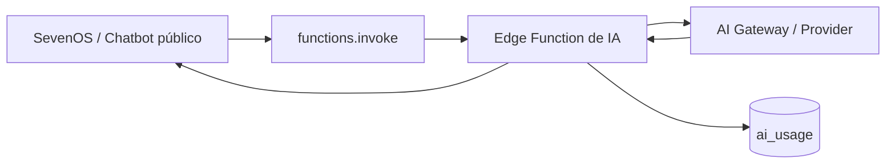

# AI Architecture

Toda chamada de IA acontece em **Edge Functions**. O browser nunca recebe chave de modelo.

## Diagrama

## Funções

| Função | Propósito | Auth |
|---|---|---|
| `ai-chat` | Chatbot do site público | Pública (uso controlado) |
| `ai-engine` | Execuções genéricas de IA do SevenOS | Admin |
| `ai-ops` | Operações assistidas sob demanda | Admin |
| `ai-ops-autonomous` | Rotina autônoma de operações | Job/segredo |
| `ai-contract-summarize` | Resumo/análise de contratos | Admin |
| `lead-score-ai` | Pontuação de leads | Admin/job |
| `logo-variations-ai` | Variações de logo | Admin |
| `brand-scan` | Extração de paleta/identidade | Admin |
| `project-generator` | Geração assistida de projeto | Admin |
| `weekly-intel-report` | Relatório semanal de inteligência | Job |
| `daily-digest` | Resumo diário operacional | Job |
| `citation-monitor` | Monitor de citações por IA | Job |
| `gsc-insights` | Insights de Search Console | Admin |

## Controle de uso

`ai_usage` registra consumo; `fn_ai_usage_check_quota` permite limitar execuções antes da chamada ao provider. Ações sugeridas/aplicadas por IA ficam em `ai_ops_actions` para auditoria humana.

## Regras

1. Nenhuma chave de IA no frontend.
2. Toda saída de IA que altera dados deve ser registrada em `ai_ops_actions` e auditável.
3. Erros do provider são propagados com status e corpo — nunca mascarados como `500` genérico.
4. Conteúdo gerado por IA exibido ao usuário deve ser identificável como tal na UI.
