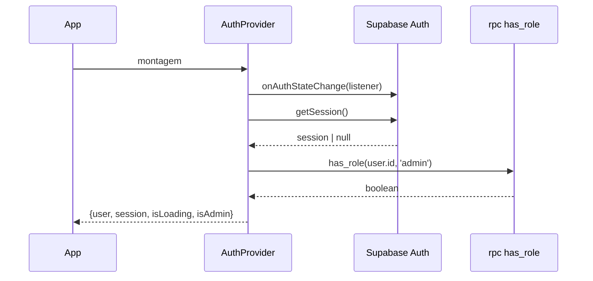

# Authentication

## Componentes

| Arquivo | Papel |
|---|---|
| `src/contexts/AuthContext.tsx` | **Source of truth** de sessão e `isAdmin` |
| `src/components/auth/ProtectedRoute.tsx` | Guarda de rota (autenticação + role) |
| `src/pages/Auth.tsx` | Login, cadastro e recuperação |
| `src/utils/authErrors.ts` | Tradução de erros para mensagens de usuário |
| `src/hooks/useSessionTracker.ts` | Registro de sessões administrativas |
| `src/hooks/useMfa.ts` | Enrolamento/verificação TOTP |

> Regra do projeto: usar **sempre** `useAuthContext` de `@/contexts/AuthContext`. O antigo `useAuth.ts` foi removido.

## Fluxo de sessão



O listener é registrado **antes** de `getSession()` para não perder eventos; a checagem de role roda fora do callback (`setTimeout 0`) para evitar deadlock do cliente Supabase.

## Autorização

- `isAdmin` é derivado exclusivamente da RPC `has_role` (SECURITY DEFINER) sobre `user_roles`.
- Papéis **nunca** ficam em `profiles`, localStorage ou claims editáveis pelo cliente.
- `ProtectedRoute` é UX, não segurança: a autorização real é RLS no banco e checagem de role nas Edge Functions.

Ver [security/AUTHORIZATION](../security/AUTHORIZATION.md).

## MFA (TOTP)

```text
mfa-enroll  → gera secret base32 + otpauth URI + backup codes → user_mfa
mfa-verify  → valida código TOTP e ativa (enabled_at)
mfa-disable → remove o registro do próprio usuário
```

## Recuperação e redirects

- `signUp` usa `emailRedirectTo: origin + "/"`.
- `resetPassword` usa `redirectTo: origin + "/auth/reset"`.
- Redirects OAuth devem sempre apontar para URL pública same-origin, nunca diretamente para rotas protegidas.
