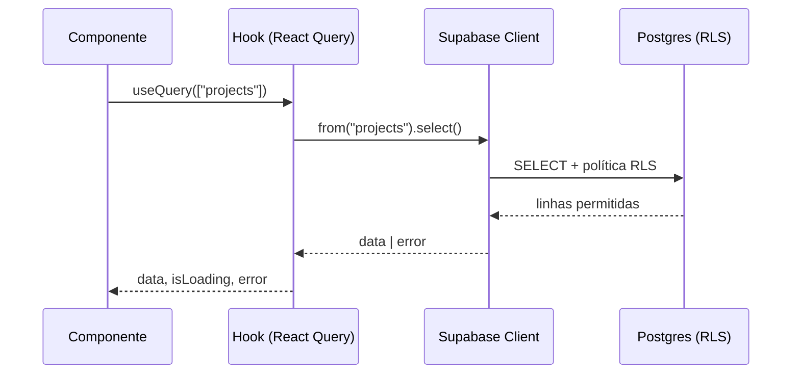
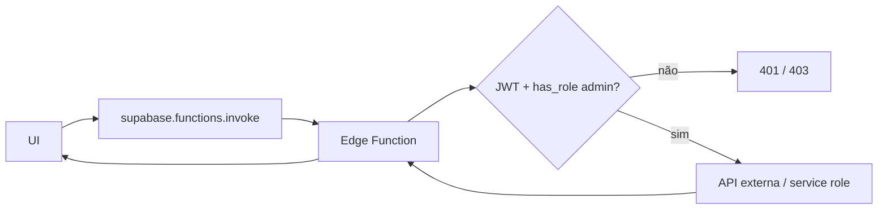

# Data Flow

## Leitura padrão (UI → banco)



Cache padrão definido em `src/app/Providers.tsx`: `staleTime` 5 min, `gcTime` 10 min, `retry` 3 com backoff exponencial, sem refetch on focus.

## Escrita

```text
UI (form) → hook mutation → Supabase (RLS valida)
          → trigger de auditoria grava em audit_log
          → invalidateQueries(chave de escopo)
```

## Operação privilegiada / externa



Segredos (tokens de provider) **nunca** trafegam para o browser — permanecem em `Deno.env` da Edge Function.

## Automação e eventos

```text
Mutação de negócio
  → emit_event / trigger
  → tabela events
  → automation-runner (cron)
  → automations (regras)
  → automation_runs (log)
  → webhook-dispatch → webhook_deliveries → webhook_dlq (falhas)
                                  ↑
                        webhook-retry-worker
```

## Jobs agendados

`pg_cron` dispara Edge Functions (`daily-digest`, `weekly-intel-report`, `health-collector`, `citation-monitor`, `automation-runner`, `webhook-retry-worker`, `vercel-watch`). Status visível em `/admin/cron` via `fn_cron_status`.

## Conteúdo público dirigido por CMS

```text
Admin (/admin/site-creation, /admin/services, /admin/blog)
  → tabelas site_page_*, services_cms, blog_posts
  → SELECT anônimo permitido por RLS + GRANT
  → páginas públicas renderizam o conteúdo
```

> Cuidado histórico: alterações de CMS só aparecem para visitantes deslogados se a política RLS **e** o `GRANT SELECT ... TO anon` existirem. Ver [database/RLS](../database/RLS.md).

## Offline

```text
Ação offline → fila IndexedDB (src/utils/offlineQueue.ts)
             → Background Sync (src/sw.ts)
             → drena para Supabase ao reconectar
```
