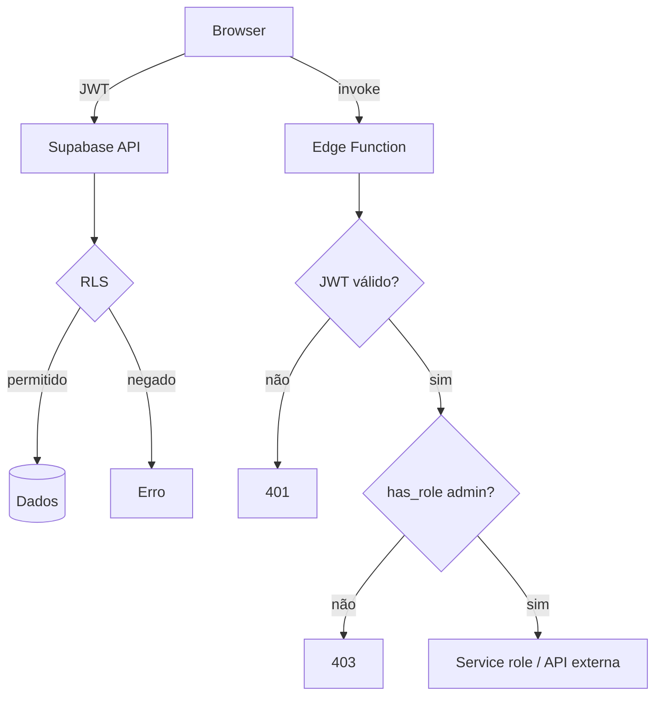

# Security (arquitetura)

## Princípios

1. **O banco é a fronteira de segurança.** UI e rotas protegidas são conveniência; RLS decide.
2. **Papéis fora do perfil.** Somente `user_roles` + `has_role` (SECURITY DEFINER).
3. **Segredos só no servidor.** Tokens de provider vivem em `Deno.env` das Edge Functions.
4. **Menor privilégio por GRANT.** `anon` só recebe `SELECT` em conteúdo público.
5. **Auditoria por padrão.** Mutações relevantes gravam em `audit_log`.

## Camadas de controle

## Controles implementados

- Verificação de JWT + `has_role('admin')` nas Edge Functions administrativas.
- Webhook do WhatsApp valida assinatura HMAC do payload recebido.
- Funções de job protegidas por token/segredo em vez de acesso aberto.
- `EXECUTE` revogado de `PUBLIC`/`anon`/`authenticated` em funções trigger-only `SECURITY DEFINER`.
- PII de contatos não é exposta a anônimos; consultas pontuais usam RPC dedicada (`contact_id_by_email`).
- `system_settings` restrito a administradores.
- Bucket `attachments` privado com URLs assinadas.
- MFA TOTP com backup codes; o segredo não é legível por outros usuários.
- Sessões administrativas rastreadas (`admin_sessions`) com revogação (`admin_revoke_session`).

## Documentos relacionados

[AUTHORIZATION](../security/AUTHORIZATION.md) · [RLS](../security/RLS.md) · [SECRETS](../security/SECRETS.md) · [EDGE_FUNCTION_SECURITY](../security/EDGE_FUNCTION_SECURITY.md) · [AUDIT_LOG](../security/AUDIT_LOG.md) · [SECURITY_CHECKLIST](../security/SECURITY_CHECKLIST.md)

## Fora de escopo desta documentação

Valores de segredos, IDs de projeto, chaves e credenciais — nunca documentados.
