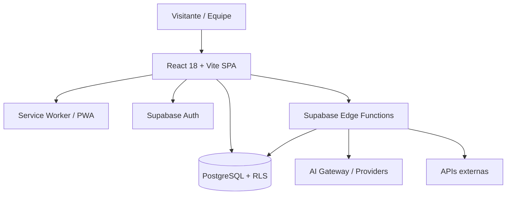

# System Overview

O repositório entrega **duas superfícies na mesma aplicação React**:

1. **SevenDevX** — site público institucional, portfólio, blog e páginas GEO/SEO.
2. **SevenOS** — ERP/CRM interno (rotas `/admin/*`), de uso exclusivo da equipe.

> O SevenOS é **interno**, não é um SaaS multi-tenant: não há billing, planos ou quotas de assinatura.

---

## Diagrama



---

## Camadas

| Camada | Local | Papel |
|---|---|---|
| Entrada | `src/main.tsx` | Bootstrap, guarda de Service Worker em iframe/preview |
| Composição | `src/App.tsx`, `src/app/Providers.tsx`, `src/app/Router.tsx` | Providers globais e roteamento |
| Apresentação pública | `src/pages/*`, `src/components/*` | Site institucional, GEO/SEO |
| Apresentação admin | `src/pages/admin/*`, `src/components/admin/*` | SevenOS |
| Domínio | `src/modules/*` | Funcionalidades de domínio do SevenOS |
| Acesso a dados | `src/hooks/*` (React Query) | Queries, mutations e cache |
| Backend gerenciado | Postgres + RLS + RPC | Regras de acesso e agregações |
| Backend privilegiado | `supabase/functions/*` | Segredos, APIs externas, jobs |

---

## Stack real

React 18 · TypeScript · Vite · TailwindCSS · shadcn/ui (Radix) · Framer Motion · React Router · TanStack React Query · Recharts · dnd-kit · Supabase (Auth, Postgres, Storage, Edge Functions, Realtime) · Vite PWA (Workbox).

---

## Superfícies de rota

- **Público:** `/`, `/about`, `/services`, `/projects`, `/blog`, `/store`, `/integracoes`, `/criacao-de-sites-profissionais`, além do cluster GEO (`/ai`, `/answers`, `/solucoes`, `/cases`, `/clusters`, `/local/:city`).
- **Autenticado:** `/profile`.
- **Admin:** `/admin` e subrotas (ver [MODULE_MAP](MODULE_MAP.md)).

## Deploy

Build Vite estático publicado na Vercel (`vercel.json` define rewrites SPA e cabeçalhos, incluindo CSP). Backend gerenciado pela Lovable Cloud (Supabase).

## Targets (não medidos automaticamente)

```txt
Target: LCP < 2.5s na home em 4G
Target: rotas admin carregadas sob lazy loading
```
